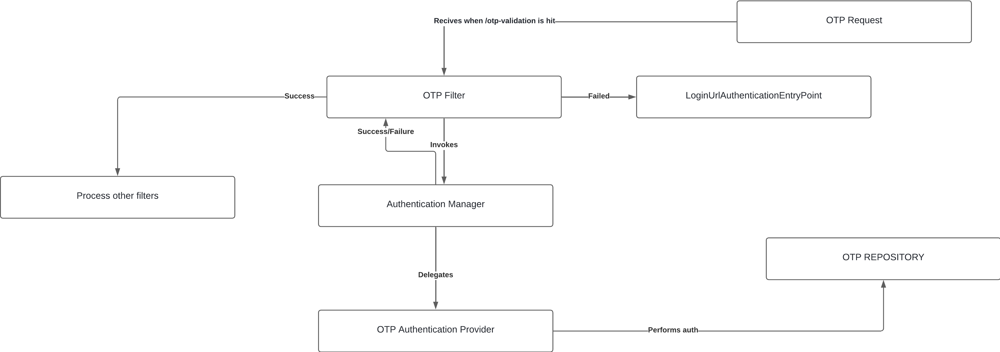

### Simple implementation of MFA 

The main idea is to add a layer of security to our application.
We can proceed by adding an OTP capabilities after the user gets authenticated by username/password.

### Implementation 

Flow : 

- The user authenticates using a username and a password, then an OTP is getting generated - printed out to the console, but can be changed to be sent via other means
- The user gets redirected to a form where he submits the code
- If the code is correct it gets redirected to the welcome page.
